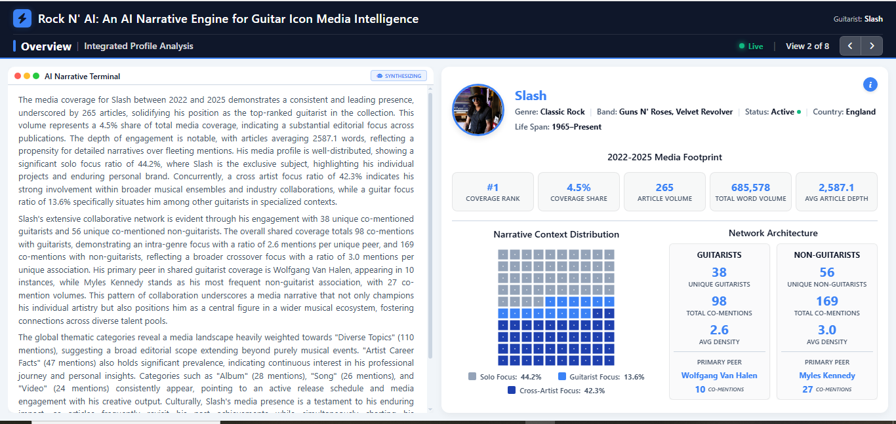

# Rock N' AI: An AI Narrative Engine for Guitar Icon Media Intelligence

An interactive Dash application that analyzes media coverage of legendary rock guitarists across major music publications (2022-2025).

## 🌐 Live Application

The application is publicly accessible at:
**[https://IvoDSBarros.pythonanywhere.com](https://IvoDSBarros.pythonanywhere.com)**

*Note: Optimized for desktop viewing*




## 📊 Data Pipeline

The system collects and analyzes articles from six core publications:
- **The New York Times**
- **Louder**
- **Loudwire**
- **Ultimate Classic Rock**
- **Kerrang!**
- **Planet Rock**

Guitarists are identified via Named Entity Recognition, drawing from *Guitar World's* "100 Greatest Guitarists of All Time."

## 🧠 Architecture: Pre-calculated Metrics + SMART RAG

### NLP Processing Pipeline

The data is processed through the following NLP stages:

- **Rock Artist Identification**: A previous Named Entity Recognition (NER) model identifies rock artists to ensure genre accuracy.

- **Guitarist Filtering**: The Rock Artist NER model is cross-referenced against *Guitar World's* '100 Greatest Guitarists' to isolate the featured icons.

- **Text Classification**: A deep learning model assigns topic labels using a weakly supervised approach derived from an antecedent rule-based system.

- **POS Tagging**: Part-of-Speech tagging separates nouns, verbs, and adjectives, enabling vocabulary profiling.

### Offline Pre-computation
- Python scripts calculate all metrics: focus ratios, trends, category distributions, vocabulary profiles, network metrics
- Results saved as JSON + Parquet for instant access
- Article texts indexed in Vector Store with full_pk, guitarist, date, categories
- Category-to-PK mappings preserved for thematic accuracy

### Runtime (Single Agent, One LLM Call)
1. **RandomDataEnforcer tool** retrieves:
   - Fixed metrics from pre-calculated JSON (never changes)
   - Random article samples (40% of corpus, truly random each run)
   - Category mappings showing which articles belong to which themes
   - Global mentions and vocabulary profiles

2. **Single LLM call** synthesizes all data following strict formatting rules:
   - Tier-based tone scaling (Rank 1-3: aggressive; Rank 4-10: institutional)
   - Category tagging format: `(topic label: category_name)`
   - Citation format: `title (Website, YYYY-MM-DD)`
   - No bullet points, no lists - pure analytical prose

3. **Post-processing**:
   - `clean_thinking_sections()` removes LLM planning artifacts
   - `extract_paragraphs_to_json()` splits report into view-ready chunks

### SMART Article Selection
- 100 articles per guitarist (40% of max count per guitarist)
- Strategic sampling: temporal + source + content diversity
- Optimized for 250K/min token limits (~150K tokens used)
- 25 articles max per category, ~1,500 tokens per article

## 📁 Report Structure

The LLM generates a comprehensive 7-section report following this exact structure:

# {Guitarist}: Comprehensive Media Analysis 2022/2025

## Executive Summary
Synthesizes basic metrics, rank, frequency, and cultural impact

## Media Focus Breakdown

### Solo Coverage
Ratio + longitudinal trends + article evidence

### Guitar-Focused Coverage
Global mentions + longitudinal trends + article evidence

### Cross Artist Coverage
Collaborations + trends + article evidence

## Thematic Category Analysis
Dominant themes with category tagging: (topic label: category_name)

## Vocabulary Profile
Linguistic DNA: nouns, verbs, adjectives that define the persona

## Media Flow Analysis
Source patterns: website → format → focus → density → depth

## Conclusion
Synthesizes cultural impact, artistic identity, and thematic patterns

## Methodological Note
Data sources and methodology

Each section is post-processed into JSON paragraphs tagged by view number (2-8) for Dash consumption.

## 🎸 Views in Dash

| View | Content | Source |
|------|---------|--------|
| 1 | Landing + Guitarist Selection Chart | Pre-calculated metrics |
| 2 | Executive Summary | JSON + Pre-calculated metrics |
| 3 | Solo Focus Narrative | JSON + Pre-calculated metrics |
| 4 | Guitar-Focused Narrative | JSON + Pre-calculated metrics |
| 5 | Cross-Artist Narrative | JSON + Pre-calculated metrics |
| 6 | Thematic Category Analysis | JSON + Pre-calculated metrics |
| 7 | Vocabulary Profile | JSON + Pre-calculated metrics |
| 8 | Media Flow Overview | JSON + Pre-calculated metrics |

## ⚡ Why This Architecture Wins

| Challenge | Solution |
|-----------|----------|
| **Latency** | All metrics pre-calculated → zero-latency UI |
| **Quota limits** | SMART sampling: 100 articles, ~150K tokens |
| **Inconsistent output** | 200+ lines of strict formatting rules |
| **Hallucinations** | Fixed metrics + real article quotes only |
| **Broken chains** | Single agent, one LLM call → never fails |
| **Dash integration** | Paragraphs extracted and tagged by view |

## 🛠️ Tech Stack

- **Frontend**: Dash Python, Plotly, HTML/CSS
- **Backend**: Python, CrewAI (single agent), RAG
- **Data Processing**: Pandas, Parquet, JSON
- **NLP**: Custom NER, Vector Store, Gemini 2.5 Flash
- **Deployment**: Ready for cloud deployment

## 📂 Repository Structure

```
rock-n-ai/
├── app.py		                              # Main Dash application
├── tools/
│   └── narrative_generator.py               # CrewAI narrative generation
├── requirements.txt	# Dependencies
├── Procfile                           		# For deployment (Heroku)
├── README.md		                           # Project documentation
├── LICENSE		# MIT License
├── assets/
│   └── images/
│       ├── pic_bob_dylan.jpg
│       ├── pic_brian_may.jpg
│       └── ...
├── components/
│   ├── __init__.py
│   ├── charts.py
│   ├── header.py
│   ├── panels.py
│   └── styles.py
├── data/
│   ├── crew_ai_narrative.json
│   └── master_analysis_table.parquet
├── utils/
│   ├── __init__.py
│   ├── config.py
│   └── data_loader.py
└── views/
    ├── __init__.py
    ├── analysis_view.py
    ├── view1_landing.py
    ├── view2_intro.py
    ├── view3_media_focus_solo.py
    ├── view7_vocabulary_profile.py
    └── view8_media_flow.py
```

## 🚀 Getting Started

### Prerequisites
- Python 3.9+
- Gemini API key

### Installation

```bash
# Clone repository
clone https://github.com/IvoDSBarros/rock-n-ai.git
cd rock-n-ai

# Install dependencies
pip install -r requirements.txt

# Set up environment variables
cp .env.example .env
# Add your GEMINI_API_KEY to .env
